# ИНФОРМАЦИОННАЯ СИСТЕМА АПТЕКИ

## Описание

Программное решение, которое осуществляет управление базой данных аптеки для учета каталога препаратов, договоров поставок, заказов; слежение за регулярностью поставок; хранение данных о пользователях.

В информационной системе хранятся данные о препаратах, клиентах аптеки, поставщиках, врачах и лечебных учреждениях для надзора за распространением препаратов по рецептам, сертификатах качества поставщиков, заказах. Управление системой разделено по ролям пользователей, где каждая группа сотрудников отвечает за определенные действия, будь то управление поступлениями, контроль над справочниками, управление каталогом препаратов, оформление заказов, управление аккаунтами и правами сотрудников. 

Разработка данного программного модуля выполнена при помощи фреймворка Django на языке программирования Python, в связке с сервером баз данных Microsoft SQL Server 2017. Программный модуль выгружает отчетные формы в формате PDF.

---
## Функционал

1) Функции системного администратора:
	- Управление учетными записями пользователей
	- Управление группами прав
2) Функции администратора
	- Управление справочниками врачей и учреждений
3) Функции менеджера поставок:
	- Добавление поставщиков
	- Оформление договоров поставок
	- Занесение информации о сертификатах на препараты поставщиков
	- Учет поступлений
4) Функции фармацевта
	- Управление каталогом аптеки
5) Функции продавца
	- Создание карточек клиентов
	- Внесение рецептов в базу
	- Оформление заказов

---
## Технологии

Язык: Python 3.13.2
Фреймворк: Django 5.2.1
Отчеты: pdfkit

---
## Установка и запуск

1. Установите Python 3.13.2 - https://www.python.org/downloads/release/python-3132/
2. Настройте и активируйте окружение 

	```
	python -m venv venv       # создание окружения
	.\venv\Scripts\activate   # активация (Windows)
	```

3. Установите зависимости в requirements.txt

	```
	pip install -r requirements.txt
	```

4. Убедитесь в соответствии данных конфигурации подключения к БД PostgreSQL настройкам вашего сервера

	```python
	# pharmacy\pharmacy\pharmacy\settings.py
	DATABASES = {
	    "default": {
	        "ENGINE": "django.db.backends.postgresql",
	        "NAME": "pharmacy_base",
	        "USER": "admin",
	        "PASSWORD": "ei539EEg8",
	        "HOST": "localhost",
	        "PORT": "5432",
	    },
	}
	```

5. Примените миграции

	```
	python manage.py migrate
	```

6. Создайте суперпользователя

	```
	python manage.py createsuperuser
	```

7. Запустите приложение

	```
	python manage.py runserver
	```

---
## Руководство пользователя

#### Авторизация

При любой попытке перехода на сайт неавторизованного пользователя перебрасывает на страницу авторизации, где ему предлагается ввести его логин и пароль для входа в свою учетную запись для дальнейшего взаимодействия с сайтом.

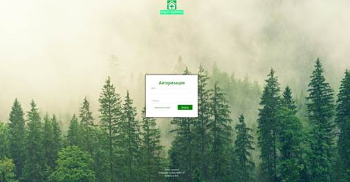

Первое, что видит пользователь после процесса авторизации, это заглавная страница сайта со ссылками к доступным для данного пользователя модулям.


Права к различным модулям назначаются только системными администраторами при создании аккаунта для пользователя и определения его в соответствующую группу.
Также из любого другого места сайта можно попасть в любой из модулей с помощью скрытого бокового меню (кнопка в левом верхнем углу) в левой части экрана.

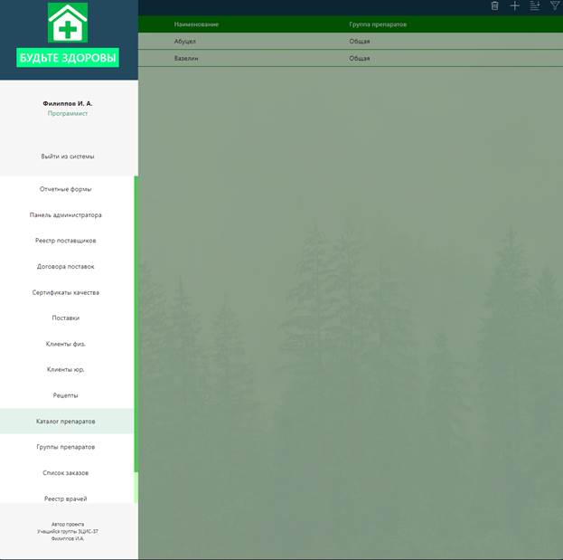

#### Создание пользователей

Итак, добавлять пользователей может только системный администратор, и только у него есть доступ панели администратора, с помощью которой он может это сделать.

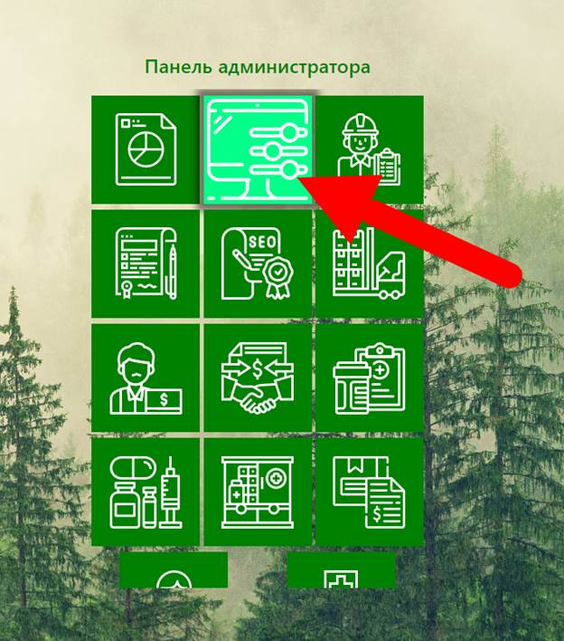

При переходе в панель администратора нас интересуют модели «Пользователи» и «Группы».

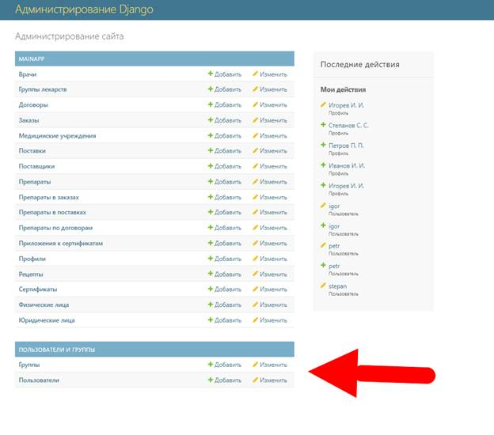

Взаимодействуя с этими двумя моделями системный администратор может как добавлять пользователей или группы, так и изменять существующие, а также делегировать или лишать прав как отдельных пользователей, так и целые группы.

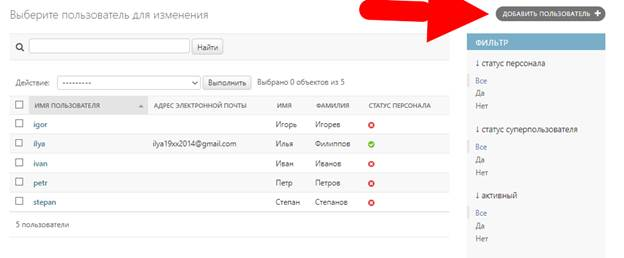

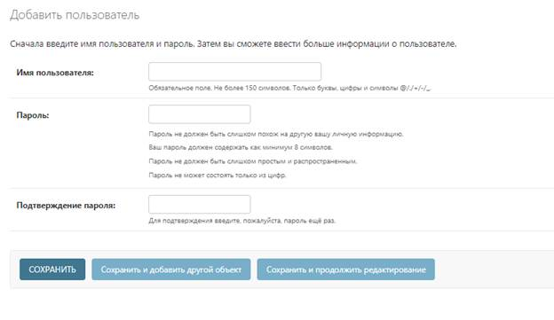

#### Выборки

Все модули системы представляют собой выборки данных определенной структуры и назначения. Пользователи наделяются правами, в соответствии с которыми они могут просматривать выборки, добавлять в них записи, удалять, либо изменять. Управление осуществляется панелью кнопок в верхнем правом углу окна браузера.

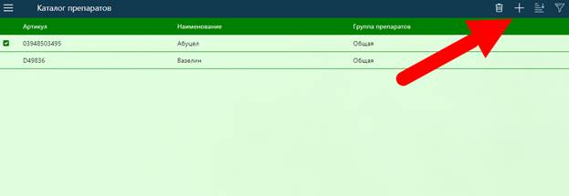

В програмном модуле предусмотрены возможности фильтрации и сортировки записей выборок.

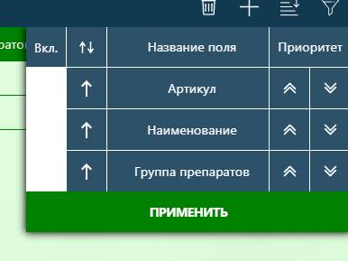

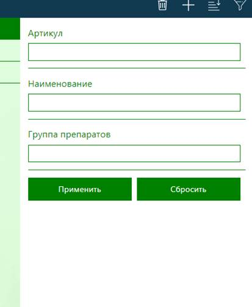

#### Добавление, изменение, удаление записей

Для добавления записей служит кнопка «+» в шапке сайта, при нажатии на которую открывается форма добавления записи в соответствующий модуль. Там же расположена кнопка удаления записей, отображаемая при выделении хотя бы одной записи в выборке.

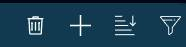

Рисунок 20 – Кнопки удаления и добавления записей

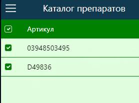
Также записи можно удалять из окна просмотра. И в том же окне присутствует кнопка для редактирования записи, при нажатии на которую открывается форма редактирования.

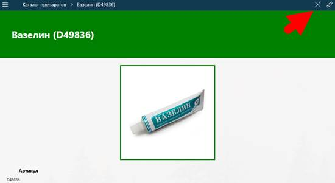

Сохранение также выполняется посредством кнопки в шапке сайта после заполнения формы.

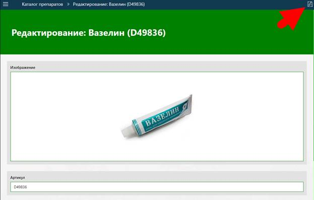

#### Формирование отчетов

Модуль отчетов доступен для всех пользователей и ссылка на него расположена вместе со ссылками к другим модулям с заглавной страницы, либо из бокового меню.

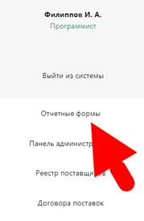


В настоящий момент в качестве примера реализовано только 4 отчетные формы доступные для формирования, представленные следующим списком.

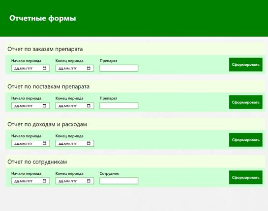

После заполнения параметров отчета и нажатия кнопи «Сформировать» будет выполнена загрузка отчета в формате pdf.

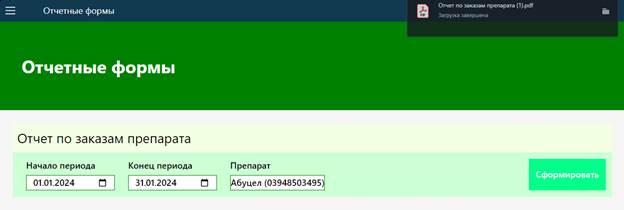

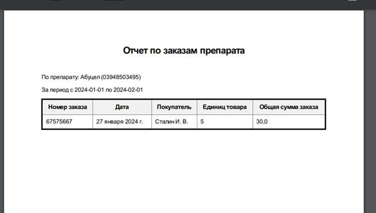
